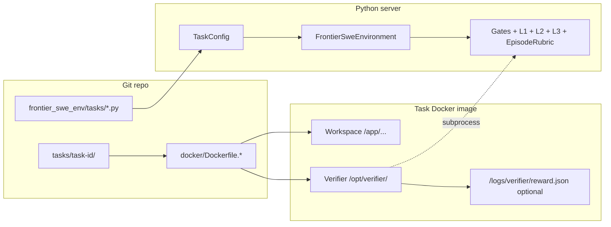

# Frontier SWE OpenEnv

A family of long-horizon software-engineering environments for [OpenEnv](https://github.com/rycerzes/OpenEnv), packaged as Docker images and mirrored to Hugging Face Spaces. Each task exposes the same OpenEnv-shaped **FastAPI** surface (Gym-style `/reset`, `/step`, `/state`, `/health`) plus **MCP** tools for planning and submission. A **composite rubric** (workspace gates, structured or regex-based L1 scores, optional LLM code and plan review) aggregates into a normalised episode reward.

This repository is organised like a small monorepo: shared Python server and client live under `frontier_swe_env/`, task assets under `tasks/<task-id>/`, and each deployable Space under `spaces/<space-name>/` (Dockerfile, README with HF card front matter, and `openenv.yaml`).

These environments are **adapted from the [FrontierSWE](https://www.frontierswe.com/) benchmark** ([`proximal-labs/frontier-swe`](https://github.com/proximal-labs/frontier-swe) on GitHub): long-horizon systems and performance problems repackaged as OpenEnv-shaped services with a shared rubric and MCP tooling. The **Tasks** table below links each OpenEnv task **one-to-one** to its official FrontierSWE write-up.

## Features

- **Shared runtime**: One FastMCP/OpenEnv stack per image; task-specific workspace, verifier, and instructions are baked into the image.
- **Gym-style control**: `POST /reset`, `POST /step`, `GET /state`, `GET /health` for training and evaluation harnesses.
- **MCP for agents**: OpenEnv JSON-RPC at `POST /mcp`, and Streamable HTTP for adapters at `/tools/mcp` (POST and GET/SSE).
- **Episode tools**: `submit_plan`, `submit_subtask`, `get_status`, `advance` (see `openenv.yaml` and each Space manifest).
- **Multi-layer scoring**: Gate scripts, L1 (tests, `reward.json`, or regex ratio), L2/L3 LLM judges when grader API env vars are set, then a weighted episode blend.

## Tasks

| Task ID | Domain | FrontierSWE write-up | OpenEnv manifest | Hugging Face Space | GHCR image |
| --- | --- | --- | --- | --- | --- |
| `notebook-compression` | Systems / compression | [Notebook compression](https://www.frontierswe.com/notebook-compression) | [`spaces/notebook/openenv.yaml`](spaces/notebook/openenv.yaml) | [rycerzes/frontier-swe-notebook](https://huggingface.co/spaces/rycerzes/frontier-swe-notebook) | `ghcr.io/3xcaffeine/frontier-swe-openenv/frontier-swe-notebook:latest` |
| `postgres-sqlite-wire-adapter` | Systems / databases / Zig | [PostgreSQL on SQLite](https://www.frontierswe.com/postgres-sqlite-wire-adapter) | [`spaces/postgres/openenv.yaml`](spaces/postgres/openenv.yaml) | [rycerzes/frontier-swe-postgres](https://huggingface.co/spaces/rycerzes/frontier-swe-postgres) | `ghcr.io/3xcaffeine/frontier-swe-openenv/frontier-swe-postgres:latest` |
| `dependent-type-checker` | PL / type theory | [Dependent type checker](https://www.frontierswe.com/dependent-type-checker) | [`spaces/type-checker/openenv.yaml`](spaces/type-checker/openenv.yaml) | [rycerzes/frontier-swe-type-checker](https://huggingface.co/spaces/rycerzes/frontier-swe-type-checker) | `ghcr.io/3xcaffeine/frontier-swe-openenv/frontier-swe-dependent-type-checker:latest` |
| `libexpat-to-x86asm` | Systems / x86-64 assembly / XML | [libexpat to assembly](https://www.frontierswe.com/libexpat-to-x86asm) | [`spaces/libexpat-to-x86asm/openenv.yaml`](spaces/libexpat-to-x86asm/openenv.yaml) | [rycerzes/frontier-swe-libexpat-to-x86asm](https://huggingface.co/spaces/rycerzes/frontier-swe-libexpat-to-x86asm) | `ghcr.io/3xcaffeine/frontier-swe-openenv/frontier-swe-libexpat-to-x86asm:latest` |

Authoritative package metadata for tooling (for example `openenv pull`) lives in the root [`openenv.yaml`](openenv.yaml).

## Task assets and runtime configuration

The repo splits responsibilities in two places that sound similar but are **not** duplicates of each other:

| Location | Role |
| --- | --- |
| [`tasks/<task-id>/`](tasks/) | **Problem pack** checked into git: human-facing `instruction.md`, verifier shell scripts, Python helpers such as `compute_reward.py`, hidden tests, datasets, and anything the Dockerfile `COPY`s into the image. This is where each task’s **reward semantics** are actually implemented (what gets run, what gets written to disk, what counts as a hard fail). |
| [`frontier_swe_env/tasks/`](frontier_swe_env/tasks/) | **Python registry** of [`TaskConfig`](frontier_swe_env/task_config.py) factories (`pg.py`, `notebook_compression.py`, …). Each module describes how the **running server** should drive scoring: paths **inside the container**, the L1 command string, `l1_score_mode`, JSON paths and anchors, timeouts, episode limits, and text used for L2/L3 LLM prompts. |

**Build time.** Per-task Dockerfiles under [`docker/`](docker/) copy a slice of `tasks/<task-id>/` into fixed locations (for example verifier assets under `/opt/verifier/`, full instructions at `/app/instruction.md` or `/opt/task/instruction.md`, workspaces under `/app/...`). Those paths are what the verifier scripts assume.

**Run time.** [`FrontierSweEnvironment`](frontier_swe_env/server/frontier_swe_env_environment.py) loads a `TaskConfig` via [`get_task_config`](frontier_swe_env/tasks/__init__.py). The task is selected with environment variables (defaults match the image):

- `FSWE_TASK_NAME` — logical name (`postgres`, `notebook-compression`, `dependent-type-checker`, `libexpat-to-x86asm`, …); aliases like `pg` or `type-checker` map to the same factories.
- `FSWE_TASK_MODE` — `training` vs `demo` (different budgets, attempts, and sometimes instruction source).

From that single config object the environment wires **shared** rubric classes to **task-specific** commands and parsers:

1. **Gate checks** — shell script from `TaskConfig.gate_script_path` (baked from `tasks/...` into the image).
2. **L1** — [`TestOutputRubric`](frontier_swe_env/rubrics/l1_tests.py) runs `TaskConfig.visible_test_command`. Depending on `l1_score_mode`, it either parses **stdout** with a regex (`ratio` and similar) or reads a structured **`reward.json`** after the verifier finishes (`reward_json` vs `reward_json_score`). Each task’s verifier under `tasks/<id>/tests/` is responsible for producing the format its mode expects.
3. **L2 / L3** — LLM judges use `task_description`, `task_domain`, and `scoring_context` from `TaskConfig` so prompts stay aligned with that task even though the judge code is shared.
4. **Episode reward** — [`EpisodeRubric`](frontier_swe_env/rubrics/episode_rubric.py) blends plan quality, mean frozen subtask scores, completion, and tool usage using weights from the same `TaskConfig`.

So: **`tasks/` defines what “correct” means operationally**; **`frontier_swe_env/tasks/` tells the server how to invoke and normalise that signal** inside the shared OpenEnv stack.

**`spaces/*/openenv.yaml`.** These manifests document the Space for judges and tooling (rubric layers, metrics, HF metadata). They should stay **consistent** with the Python `TaskConfig` and Docker layout for the same task. The live server inside the image is driven by **`TaskConfig` + env vars**, not by parsing `openenv.yaml` at runtime.



### L1 score modes (per-task flavour)

[`TaskConfig.l1_score_mode`](frontier_swe_env/task_config.py) selects how L1 turns verifier output into a number in \([0, 1]\):

| Mode | Typical task | Meaning |
| --- | --- | --- |
| `ratio` | Postgres wire adapter | Regex on test runner stdout (`Total: N/M passed`). |
| `reward_json` | Notebook compression | Verifier writes JSON (e.g. `geom_mean_ratio`, `status`); normalisation is mode-specific in `TestOutputRubric`. |
| `reward_json_score` | Dependent type checker, libexpat assembly | Verifier writes a numeric `score` (field configurable); linear map between `reward_json_score_anchors`, optional hard-fail handling. |

Adding a new task usually means: add `tasks/new-task/`, extend a Dockerfile to copy it, add `frontier_swe_env/tasks/new_task.py` plus [`register_task`](frontier_swe_env/tasks/__init__.py), and add a Space manifest under `spaces/`.

## Task catalog

Short descriptions of what each episode asks for and how **L1** is determined. (Gates, L2 code review, L3 plan review, and episode blending behave the same way structurally; only L1 and task copy differ.)

### Notebook compression (`notebook-compression`)

Agents implement a **lossless** Jupyter `.ipynb` codec as `/app/run` with `fit` / `compress` / `decompress` stages. The hidden verifier under [`tasks/notebook-compression/tests/`](tasks/notebook-compression/tests/) runs the full pipeline and writes [`reward.json`](tasks/notebook-compression/tests/compute_reward.py) with corpus-driven metrics; **byte-exact round-trip** failures are hard fails. Python config in [`notebook_compression.py`](frontier_swe_env/tasks/notebook_compression.py) sets `l1_score_mode="reward_json"`, long `l1_timeout_s`, and `scoring_context` for judges. Benchmark write-up: [FrontierSWE — Notebook compression](https://www.frontierswe.com/notebook-compression).

### Postgres / SQLite wire adapter (`postgres-sqlite-wire-adapter`)

Agents implement a **Zig** binary that speaks enough of the **PostgreSQL wire protocol** to satisfy a tiered compat suite while using **SQLite** for storage. L1 is primarily **`ratio`** mode: the configured command runs [`pg_compat_test.sh`](tasks/postgres-sqlite-wire-adapter/tests/pg_compat_test.sh)-style output and the rubric parses pass counts from stdout. Config and copy live in [`pg.py`](frontier_swe_env/tasks/pg.py) and [`tasks/postgres-sqlite-wire-adapter/`](tasks/postgres-sqlite-wire-adapter/). Benchmark write-up: [FrontierSWE — PostgreSQL on SQLite](https://www.frontierswe.com/postgres-sqlite-wire-adapter).

### Dependent type checker (`dependent-type-checker`)

Agents implement a **Rust** type checker for a small dependently typed surface language; the release binary is exercised by a large accept/reject corpus plus latency benchmarks vs a reference. The verifier emits **`reward_json_score`** with gates on accept/reject rates and anti-cheat signals in JSON. Anchors and timeouts are set in [`dependent_type_checker.py`](frontier_swe_env/tasks/dependent_type_checker.py); the heavy spec and tests live under [`tasks/dependent-type-checker/`](tasks/dependent-type-checker/). Benchmark write-up: [FrontierSWE — Dependent type checker](https://www.frontierswe.com/dependent-type-checker).

### libexpat to x86-64 assembly (`libexpat-to-x86asm`)

Agents produce **`/app/asm-port/libexpat.so`** implementing the **libexpat C ABI** in assembly (no vendored C core). The verifier builds reference C libexpat, runs upstream tests and benchmarks, and writes **`reward_json_score`** (correctness plus performance, with hard fails for missing `.so` or anti-cheat). See [`libexpat_to_x86asm.py`](frontier_swe_env/tasks/libexpat_to_x86asm.py) and [`tasks/libexpat-to-x86asm/`](tasks/libexpat-to-x86asm/). Benchmark write-up: [FrontierSWE — libexpat to x86-64 assembly](https://www.frontierswe.com/libexpat-to-x86asm).

## Quick start

### Install (Python 3.13)

```bash
uv sync
```

Optional extras:

```bash
uv sync --extra test
```
For training on local
```bash
uv sync --extra training
```

### Run the API locally (development)

The full task workspace and verifiers are intended to run inside the published Docker images. For a minimal local smoke test of the HTTP app only:

```bash
uv run uvicorn frontier_swe_env.server.app:app --host 127.0.0.1 --port 8000 --reload
```

Then open `http://127.0.0.1:8000/health`.

### Run a task image

Replace the image tag with the task you need (see table above). Grader-related env vars are optional unless you want LLM rubric layers to run inside the container.

```bash
docker run --rm -p 8000:8000 \
  -e FSWE_GRADER_MODEL=... \
  -e FSWE_GRADER_API_URL=... \
  -e FSWE_GRADER_API_KEY=... \
  ghcr.io/3xcaffeine/frontier-swe-openenv/frontier-swe-postgres:latest
```

For an end-to-end baseline over WebSocket (connect, `reset`, repeated `step`), see [`scripts/run_baseline.py`](scripts/run_baseline.py).

## Python client

```python
import asyncio
from frontier_swe_env.client import FrontierSweEnv
from frontier_swe_env.models import FrontierSweAction


async def main():
    client = FrontierSweEnv(base_url="http://localhost:8000")
    await client.connect()
    try:
        result = await client.reset()
        print(result.observation.phase)
        result = await client.step(FrontierSweAction(message="Your turn"))
        print(result.observation.response)
    finally:
        await client.close()


asyncio.run(main())
```

The client maintains a WebSocket session to the server; see `FrontierSweEnv` in [`frontier_swe_env/client.py`](frontier_swe_env/client.py) for `from_docker_image` and timeout options.

## MCP tools (all tasks)

| Tool | Purpose |
| --- | --- |
| `submit_plan` | Propose subtasks (`id`, `description`, `acceptance_criteria`); moves PLANNING → EXECUTING. |
| `submit_subtask` | Run L1 + L2 scoring for the given `subtask_id`. |
| `get_status` | Snapshot of phase, scores, time remaining, feedback. |
| `advance` | Freeze the current subtask score and advance to the next. |

Implementations are registered in [`frontier_swe_env/server/mcp_tools.py`](frontier_swe_env/server/mcp_tools.py).

## Environment variables

Typical deployment sets **agent** variables (for the in-container coding harness) and **grader** variables (for LLM rubric layers):

| Prefix | Role |
| --- | --- |
| `FSWE_AGENT_MODEL`, `FSWE_AGENT_API_URL`, `FSWE_AGENT_API_KEY` | Agent LLM (also used to generate `/root/.pi/agent/models.json` in the entrypoint when `FSWE_AGENT_API_URL` is set). |
| `FSWE_GRADER_MODEL`, `FSWE_GRADER_API_URL`, `FSWE_GRADER_API_KEY` | LLM judges for L2/L3 layers in the rubric. |

Exact behaviour is defined per task in each Space `openenv.yaml` under `rubric.layers`.

## Hugging Face Spaces

CI assembles a minimal Space directory (root `Dockerfile`, `README.md`, `openenv.yaml`) from `spaces/<task>/` via [`scripts/prepare_hf_space.py`](scripts/prepare_hf_space.py). The **HF — Sync** workflow pushes to `spaces/{HF_OWNER}/frontier-swe-{notebook|postgres|type-checker|libexpat-to-x86asm}` after images build on `main`.

## Training (offline RL)

A single Frontier SWE episode often runs on the order of **45 minutes to about 90 minutes**, depending on the task, verifier cost, and agent behaviour. That makes dense **online** RL on live environments impractical at scale, so this project uses **offline RL**: collect fixed trajectories, post-process rewards and hindsight signals, build a static training set, then fine-tune on Hugging Face with **Trackio** for metrics.

The walk-through below uses the **`postgres-sqlite-wire-adapter`** task as the reference pipeline.

### Data collection and post-processing

1. **Rollouts** — [`scripts/collect_trajectories.py`](scripts/collect_trajectories.py) was used to gather **20 episodes** on a **2× NVIDIA A100** host running **sglang**, with the agent powered by **[`Qwen/Qwen3.6-27B`](https://huggingface.co/Qwen/Qwen3.6-27B)** (Qwen 3.6 27B). Run id **pg-01** labels this batch in tooling and dataset names.
2. **Backfill** — Some episodes finished without a persisted **`episode_reward`** because of a server-side bug; [`scripts/backfill_rewards.py`](scripts/backfill_rewards.py) was run to fill those fields from episode metadata.
3. **Hindsight** — [`scripts/compute_hindsight_scores.py`](scripts/compute_hindsight_scores.py) was run with the same **Qwen 3.6 27B** stack to attach per-step hindsight quantities (HCAPO-style) for training. How that differs from the original HCAPO formulation (paper [2603.08754](https://arxiv.org/abs/2603.08754)) will be written up in [`training/README.md`](training/README.md) once that document is added to the repo.

The **raw trajectory bundle** (per-episode `result.json`, `pi_session.jsonl`, `container_logs.txt`, optional `hindsight_scores.json`) is published on Hugging Face as **[`rycerzes/fswe-pg-01-traj-q36-27b`](https://huggingface.co/datasets/rycerzes/fswe-pg-01-traj-q36-27b)**.

### HCAPO dataset build

From a local `trajectories/` tree, the JSONL used for fine-tuning was produced with:

```bash
uv run python scripts/build_hcapo_dataset.py \
  --input-dir trajectories \
  --output-dir datasets \
  --min-reward 0.05 \
  --omega 1.0
```

The resulting **HCAPO training set** is **[`rycerzes/fswe-hcapo-pg-01-trajectories`](https://huggingface.co/datasets/rycerzes/fswe-hcapo-pg-01-trajectories)** (messages + step advantages derived from the pg-01 trajectories).

### Fine-tuning run

Training was launched with:

```bash
./scripts/launch_hf_space.sh --with-dataset-upload
```

That configuration runs **3 epochs** over **18 optimizer steps** on the Space-backed trainer (dataset upload + run as implemented in [`scripts/launch_hf_space.sh`](scripts/launch_hf_space.sh)).

**Metrics dashboard (Trackio on Hugging Face):** [`rycerzes/trackio`](https://huggingface.co/spaces/rycerzes/trackio) — run name **`fswe-hcapo-pg-01-qwen36-27b`**.


The screenshot above (smoothing ≈ 20 on the step axis) shows a **post-training** phase on the HCAPO dataset:

- **Loss** decreases from roughly **1.0** at the start of the plotted window to about **0.75** by the end (**~25%** relative drop), with noisy raw traces but a clear downward trend in the smoothed curve.
- **Epoch** advances linearly to approximately **2.7** over the **18** logged steps, consistent with targeting **3 epochs** in a short run.
- **Learning rate** follows a **warmup then decay**: it rises toward a peak near the middle of the run (on the order of **3.5×10⁻⁶**) and falls toward roughly **1.5×10⁻⁶** by the final steps.
- **Gradient norm** stays in a moderate band (mostly about **1.0–1.5**, ending near **1.2**), which suggests optimization without obvious gradient blow-ups for this snapshot.
- **Global step** in the sidebar advances in line with the trainer (e.g. into the low tens over the same window)q

Together, these curves read as a **successful small-scale sanity fine-tune**: loss improves steadily, the LR schedule behaves as expected, and gradients remain bounded.

## Repository layout

- **`frontier_swe_env/`** — FastAPI app, [`FrontierSweEnvironment`](frontier_swe_env/server/frontier_swe_env_environment.py), shared rubrics, MCP tools, [`TaskConfig`](frontier_swe_env/task_config.py), task registry under [`frontier_swe_env/tasks/`](frontier_swe_env/tasks/), models, client.
- **`tasks/<task-id>/`** — Instructions, verifier scripts, rewards, and data **consumed at image build** (see [Task assets and runtime configuration](#task-assets-and-runtime-configuration)).
- **`docker/`** — Shared base image, per-task Dockerfiles, [`openenv_entrypoint.sh`](docker/openenv_entrypoint.sh) (uvicorn + optional pi models).
- **`spaces/`** — Thin HF Space wrappers: Dockerfile pin, README (HF card), `openenv.yaml` for external metadata.

Each Space README under `spaces/*/README.md` is the human-facing description for that Hugging Face Space (including YAML front matter for the Space card).

## Testing

Task-specific verifiers and reward scripts live under `tasks/<task-id>/tests/`. There is no single top-level pytest suite yet; run task-local scripts as documented in each task directory when you change a verifier.

## About

**frontier-swe-openenv** packages Frontier-style long-horizon tasks for [OpenEnv](https://github.com/rycerzes/OpenEnv), adapted from **[FrontierSWE](https://www.frontierswe.com/)** ([`proximal-labs/frontier-swe`](https://github.com/proximal-labs/frontier-swe)). Official benchmark task pages for the four environments here: [postgres-sqlite-wire-adapter](https://www.frontierswe.com/postgres-sqlite-wire-adapter), [libexpat-to-x86asm](https://www.frontierswe.com/libexpat-to-x86asm), [dependent-type-checker](https://www.frontierswe.com/dependent-type-checker), [notebook-compression](https://www.frontierswe.com/notebook-compression).

The OpenEnv runtime dependency is pinned in [`pyproject.toml`](pyproject.toml) (`openenv-core` git source).
